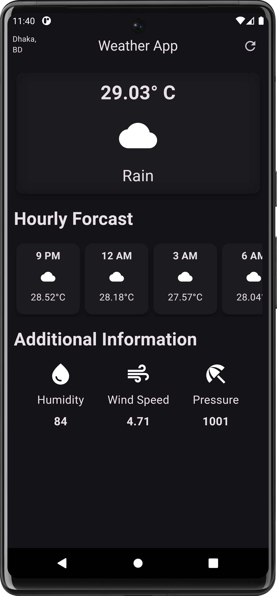
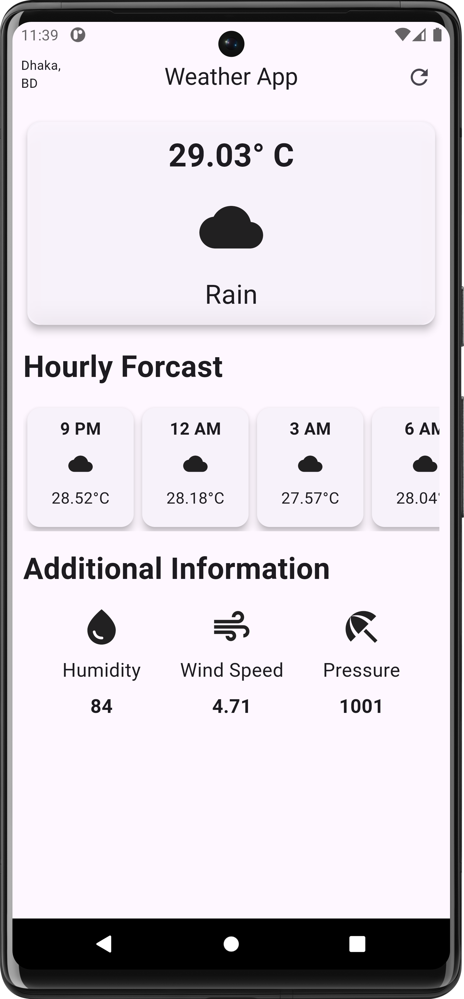

# Flutter Weather App

This Flutter Weather App fetches real-time weather data using the OpenWeather API. It displays the current temperature, weather conditions, and a 5-hour forecast, along with additional details like wind speed, humidity, and pressure.

## Features

- **Current Weather:** Displays the current temperature, weather icon, and condition.
- **Hourly Forecast:** Shows the next 5 hours of temperature and weather icons.
- **Additional Information:** Includes wind speed, humidity, and pressure.

## Permissions

- **Location Access:** The app requires permission to access the device's location to provide accurate weather data for the current location.

## Screenshots

## Installation

1. Download the APK file from the [GitHub releases](https://github.com/73-sk-nahid/weather_app/app-release.apk) page.
2. Install the APK on your Android device.
3. Grant location permission when prompted.

## API

This app uses the [OpenWeather API](https://openweathermap.org/api) to fetch weather data.

## Contributing

Contributions are welcome! 

## Contact

For any inquiries, please contact [nahidsheikh2001@gmail.com](mailto:nahidsheikh2001@gmail.com).
